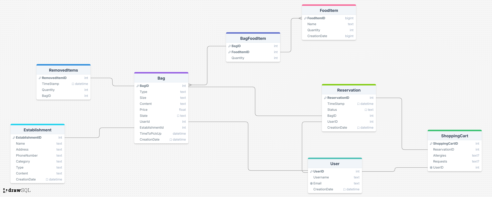

# Table of contents

<!-- TOC -->

- [Table of contents](#table-of-contents)
- [Group "PAKO"](#group-pako)
    - [Members](#members)
- [Exercise "Rescuing Surplus Food"](#exercise-rescuing-surplus-food)
- [Style approach](#style-approach)
- [Prerequisites](#prerequisites)
    - [Dependencies](#dependencies)
- [Project Structure](#project-structure)
    - [Folder and File Descriptions](#folder-and-file-descriptions)
- [Lab Journal](#lab-journal)
    - [Lab 1](#lab-1)
        - [Objects and Properties](#objects-and-properties)
            - [FoodItem](#fooditem)
            - [Bag](#bag)
            - [Establishment](#establishment)
            - [ShoppingCart](#shoppingcart)
            - [User](#user)
            - [Reservation](#reservation)
        - [Relationships](#relationships)
    - [Lab 2](#lab-2)
        - [Database Schema Documentation](#database-schema-documentation)
            - [Tables and Attributes](#tables-and-attributes)
                - [FoodItem](#fooditem)
                - [Bag](#bag)
                - [BagFoodItem](#bagfooditem)
                - [RemovedItems](#removeditems)
                - [User](#user)
                - [Establishment](#establishment)
                - [Reservation](#reservation)
                - [ShoppingCart](#shoppingcart)
            - [Relationships Overview](#relationships-overview)

<!-- /TOC -->

# Group "PAKO"

## Members
- s337165 Simone Pio Candido
- s348016 Lucio Fuoco
- s346267 Emre Elçi
- s336914 Giovanni Martinese
- s347289 Taha Yusuf Gandhi

# Exercise ["Rescuing Surplus Food"](https://polito-webapp1.github.io/lab-2025/Lab00/SurplusFood.pdf)

# Style approach

We will loosely follow the [Google JavaScript Style Guide](https://google.github.io/styleguide/jsguide.html). This means we’ll always insert semicolons after each statement (as mentioned by our professor in the first lesson).

# Prerequisites

Before starting, ensure that Node.js is installed on your computer.  
If not, you can download version 22.x (LTS) from [Node.js official website](https://nodejs.org/en/).

## Dependencies
The project uses the following dependencies:
- [day.js](https://day.js.org/) - Used for date handling and formatting.
- [sqlite3](https://www.npmjs.com/package/sqlite3) - SQLite database driver for Node.js.

To install dependencies, run:
```sh
npm init # if not already done
npm install dayjs sqlite3
```

# Project Structure

The project structure is organized as follows:

```
node_modules/                # Installed modules via npm
src/                         # Main source code directory
│
├── db/
│   ├── TODO:
│   ├── TODO:
│   ├── TODO:
│
├── models/                  # Domain models
│   ├── Bag.mjs              # Bag model
│   ├── BagCollection.mjs    # Bag collection
│   ├── Establishment.mjs    # Establishment model
│   ├── EstablishmentCollection.mjs  # Establishment collection
│   ├── FoodItem.mjs         # Food item model
│   ├── FoodItemCollection.mjs    # Food item collection
│   ├── Reservation.mjs      # Reservation model
│   ├── ReservationCollection.mjs   # Reservation collection
│   ├── ShoppingCart.mjs     # Shopping cart model
│   ├── User.mjs             # User model
│   └── UserCollection.mjs   # User collection
│
├── services/                # Project services
│   ├── dataService.mjs      # Data handling service
|   ├── TODO:
│   └── TODO: anything to maipulate query, for example query for bag (bagService.mjs)
│
├── index.mjs                # Main entry point of the application
│
.gitignore                   # Git ignore file
package-lock.json            # npm lock file
package.json                 # npm configuration file
README.md                   # This file, describing the project
```

## Folder and File Descriptions

- **`src/models/`**: Contains domain models, each representing an entity in the system (e.g., `Bag`, `Establishment`, `Reservation`).
  
- **`src/services/`**: Contains services handling business logic and data interaction (e.g., `dataService.mjs`).

- **`src/index.mjs`**: The main entry point of the application, where the process is initiated.

- **`package.json`**: Contains project configuration, including dependencies and scripts.

- **`package-lock.json`**: Manages precise versions of dependencies to ensure consistency across environments.

# Lab Journal

## [Lab 1](https://polito-webapp1.github.io/lab-2025/Lab01/Lab01.pdf)

The application is structured around the following main objects and their relationships:

### Objects and Properties

#### FoodItem
- `id`: Unique identifier  
- `name`: Name of the food item  
- `quantity`: Quantity of the item  

#### Bag
- `id`: Unique identifier  
- `type`: `"surprise"` or `"regular"`  
- `content`: List of `FoodItem` objects (only for regular bags)  
- `size`: `"small"`, `"medium"`, or `"large"`  
- `price`: Cost of the bag  
- `establishmentId`: Reference to the `Establishment` offering this bag  
- `timeToPickUp`: Pickup time range  
- `state`: `"available"` or `"reserved"`  
- `userId`: Nullable, references the `User` who reserved the bag  

#### Establishment
- `id`: Unique identifier  
- `name`: Name of the establishment  
- `address`: Physical location  
- `phoneNumber`: Contact number  
- `category`: Type of food/cuisine  
- `type`: `"store"` or `"restaurant"`  
- `bags`: List of `Bag` objects available at this establishment  

#### ShoppingCart
- `id`: Unique identifier  
- `userId`: References the `User` who owns the cart  
- `reservations`: List of selected `Reservation` objects
- `allergies`: Optional text field for allergies  
- `requests`: Optional text field for special requests  

#### User
- `id`: Unique identifier  
- `name`: Name of the user  
- `email`: Email address of the user  
- `password`: Password for the user's account  
- `shoppingCart`: References the `ShoppingCart` associated with the user  
- `reservations`: List of `Reservation` objects made by the user  

#### Reservation
- `id`: Unique identifier  
- `userId`: References the `User` who made the reservation  
- `bags`: References the reserved `Bags`  
- `timestamp`: Time of reservation  
- `status`: `"active"` or `"canceled"`  

### Relationships
- **One `Establishment` has many `Bags`.**  
- **One `Bag` belongs to one `Establishment`.**  
- **One `Bag` (if reserved) belongs to one `User`.**  
- **One `User` has one `ShoppingCart`.**  
- **One `ShoppingCart` contains multiple `Reservations`.**  
- **One `User` can have multiple `Reservations`.**  
- **One `Reservation` links one `User` to one `Bag`.**  

## [Lab 2](https://polito-webapp1.github.io/lab-2025/Lab02/Lab02.pdf)

### **Database Schema Documentation**  

This database schema is designed to manage food items, bags, users, establishments, reservations, and shopping carts. Below is a description of the main tables and their attributes.

[Link for schema](https://drawsql.app/teams/pako-1/diagrams/lab2)



#### **Tables and Attributes**  

##### **FoodItem**  
Stores information about individual food items.  
- `FoodItemID` (INTEGER, PK, AUTOINCREMENT) – Unique identifier for each food item.  
- `Name` (TEXT, NOT NULL) – Name of the food item.  
- `Quantity` (INTEGER, DEFAULT 0) – Available quantity of the food item.  
- `CreationDate` (DATETIME, DEFAULT CURRENT_TIMESTAMP) – Timestamp when the food item was added.  

---

##### **Bag**  
Represents a bag that contains food items, associated with users and establishments.  
- `BagID` (INTEGER, PK, AUTOINCREMENT) – Unique identifier for the bag.  
- `Type` (TEXT, NOT NULL) – Type of bag.  
- `Size` (TEXT) – Size of the bag.  
- `Content` (TEXT) – Description of the bag’s content.  
- `Price` (REAL) – Price of the bag.  
- `State` (TEXT, DEFAULT 'available') – Current state of the bag (e.g., available, reserved, sold).  
- `UserID` (INTEGER, FK) – Reference to the user associated with the bag.  
- `EstablishmentID` (INTEGER, FK) – Reference to the establishment providing the bag.  
- `TimeToPickUp` (DATETIME) – Pickup time for the bag.  
- `RemovedItems` (TEXT) – List of removed food items.  
- `CreationDate` (DATETIME, DEFAULT CURRENT_TIMESTAMP) – Timestamp when the bag was created.  

---

##### **BagFoodItem**  
A bridge table for the many-to-many relationship between `Bag` and `FoodItem`.  
- `BagID` (INTEGER, PK, FK) – Reference to a `Bag`.  
- `FoodItemID` (INTEGER, PK, FK) – Reference to a `FoodItem`.  
- `Quantity` (INTEGER) – Number of food items in the bag.  

---

##### **RemovedItems**  
Tracks items removed from bags.  
- `RemovedItemID` (INTEGER, PK, AUTOINCREMENT) – Unique identifier for removed items.  
- `TimeStamp` (DATETIME, PK, DEFAULT CURRENT_TIMESTAMP) – Timestamp of removal.  
- `Quantity` (INTEGER) – Number of items removed.  
- `BagID` (INTEGER, FK) – Reference to the bag from which items were removed.  

---

##### **User**  
Stores user information.  
- `UserID` (INTEGER, PK, AUTOINCREMENT) – Unique identifier for the user.  
- `Username` (TEXT, NOT NULL) – User's name.  
- `Email` (TEXT, NOT NULL, UNIQUE) – User's email address.  
- `CreationDate` (DATETIME, DEFAULT CURRENT_TIMESTAMP) – Timestamp when the user was created.  

---

##### **Establishment**  
Represents an establishment offering food bags.  
- `EstablishmentID` (INTEGER, PK, AUTOINCREMENT) – Unique identifier for the establishment.  
- `Name` (TEXT, NOT NULL) – Name of the establishment.  
- `Address` (TEXT, NOT NULL) – Address of the establishment.  
- `PhoneNumber` (TEXT) – Contact phone number.  
- `Category` (TEXT) – Category of the establishment (e.g., restaurant, grocery store).  
- `Type` (TEXT) – Type of the establishment.  
- `Content` (TEXT) – Description of available bags.  
- `CreationDate` (DATETIME, DEFAULT CURRENT_TIMESTAMP) – Timestamp when the establishment was added.  

---

##### **Reservation**  
Stores reservations of bags by users.  
- `ReservationID` (INTEGER, PK, AUTOINCREMENT) – Unique identifier for the reservation.  
- `TimeStamp` (DATETIME, DEFAULT CURRENT_TIMESTAMP) – Time when the reservation was made.  
- `Status` (TEXT, DEFAULT 'reserved') – Status of the reservation.  
- `BagID` (INTEGER, FK) – Reference to the reserved bag.  
- `UserID` (INTEGER, FK) – Reference to the user who made the reservation.  
- `CreationDate` (DATETIME, DEFAULT CURRENT_TIMESTAMP) – Timestamp when the reservation was created.  

---

##### **ShoppingCart**  
Manages user-specific shopping preferences and reservations.  
- `ShoppingCartID` (INTEGER, PK, AUTOINCREMENT) – Unique identifier for the shopping cart.  
- `ReservationID` (INTEGER, FK) – Reference to an active reservation.  
- `Allergies` (TEXT) – Notes on user allergies.  
- `Requests` (TEXT) – Additional requests by the user.  
- `UserID` (INTEGER, UNIQUE, FK) – Reference to the user (each user can have only one shopping cart).  

---

#### **Relationships Overview**  
- `FoodItem` and `Bag` have a many-to-many relationship through `BagFoodItem`.  
- `Bag` is linked to `User` and `Establishment`.  
- `RemovedItems` tracks items removed from `Bag`.  
- `Reservation` links `User` and `Bag`, tracking reservations.  
- `ShoppingCart` connects `User` to a `Reservation`, storing additional user preferences.  