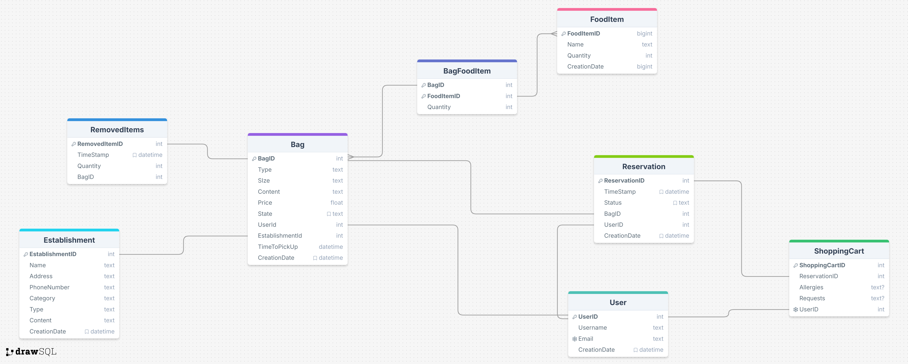
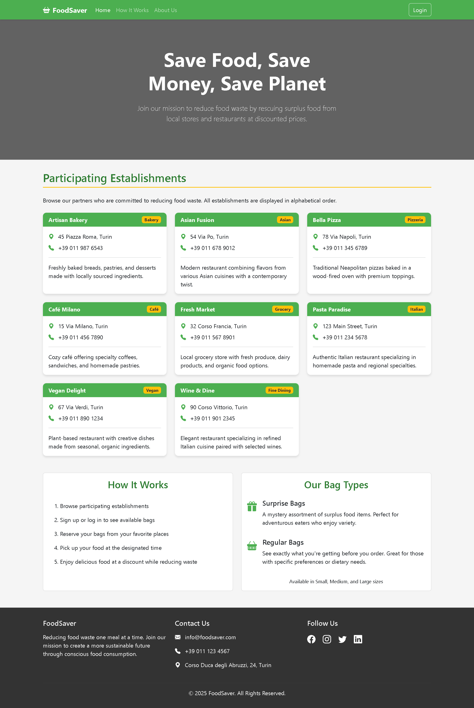
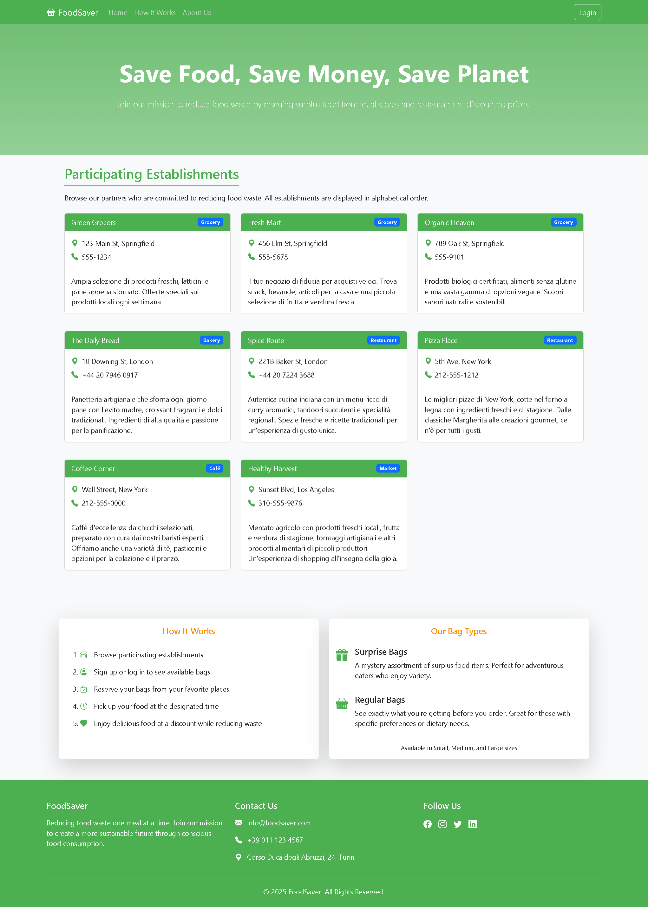
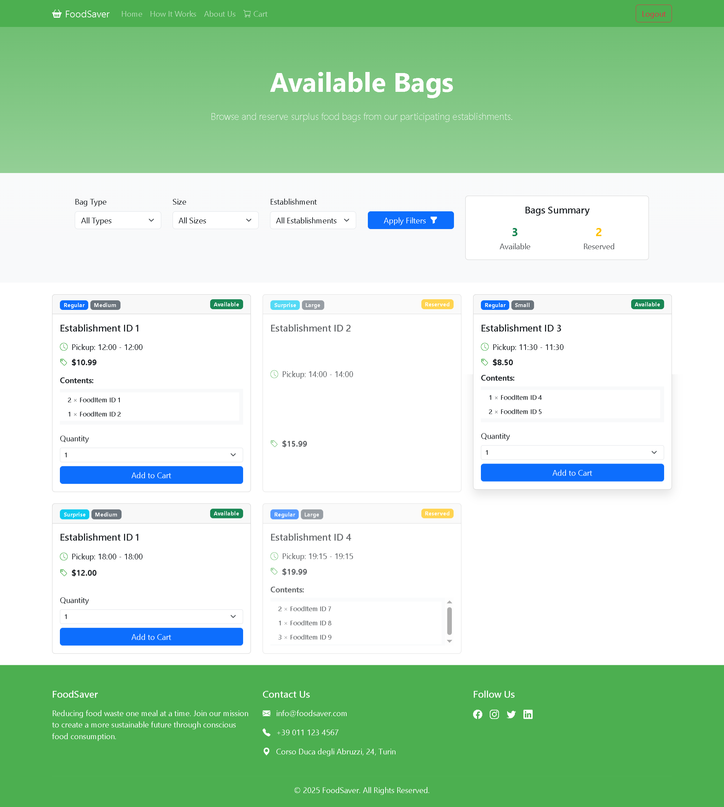
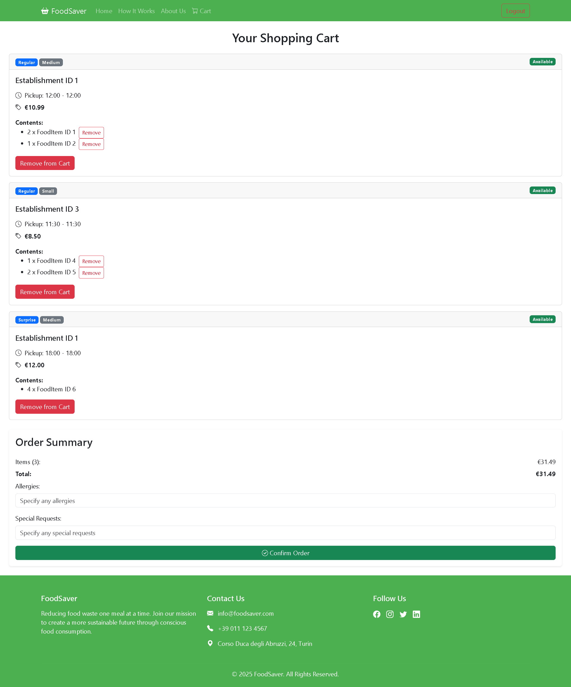

# Table of contents

- [Table of contents](#table-of-contents)
- [Group "PAKO"](#group-pako)
    - [Members](#members)
- [Exercise "Rescuing Surplus Food"](#exercise-rescuing-surplus-food)
- [Style approach](#style-approach)
- [Prerequisites](#prerequisites)
    - [Dependencies](#dependencies)
        - [Development Dependencies](#development-dependencies)
    - [Setting Up React](#setting-up-react)
    - [Database Management](#database-management)
- [Project Structure](#project-structure)
    - [Folder and File Descriptions](#folder-and-file-descriptions)
- [Lab Journal](#lab-journal)
    - [Lab 1](#lab-1)
        - [Objects and Properties](#objects-and-properties)
            - [FoodItem](#fooditem)
            - [Bag](#bag)
            - [Establishment](#establishment)
            - [ShoppingCart](#shoppingcart)
            - [User](#user)
            - [Reservation](#reservation)
        - [Relationships](#relationships)
    - [Lab 2](#lab-2)
        - [Database Schema Documentation](#database-schema-documentation)
            - [Tables and Attributes](#tables-and-attributes)
            - [FoodItem](#fooditem)
            - [Bag](#bag)
            - [BagFoodItem](#bagfooditem)
            - [RemovedItems](#removeditems)
            - [User](#user)
            - [Establishment](#establishment)
            - [Reservation](#reservation)
            - [ShoppingCart](#shoppingcart)
            - [Relationships Overview](#relationships-overview)
    - [Lab 3](#lab-3)
        - [Es1](#es1)
        - [Food Item](#food-item)
            - [[GET] /food-items](#get-food-items)
            - [[GET] /food-items/search](#get-food-itemssearch)
            - [[GET] /food-items/{id}](#get-food-itemsid)
            - [[POST] /food-items](#post-food-items)
            - [[PUT] /food-items/{id}](#put-food-itemsid)
            - [[DELETE] /food-items/{id}](#delete-food-itemsid)
        - [Establishment](#establishment)
            - [[GET] /establishments](#get-establishments)
        - [Bag APIs](#bag-apis)
            - [[GET] /api/bags](#get-apibags)
            - [[GET] /api/bags/by-date-range](#get-apibagsby-date-range)
        - [Reservation](#reservation)
            - [[GET] /api/reservations](#get-apireservations)
            - [[GET] /api/reservations/{id}](#get-apireservationsid)
        - [Shooping Cart](#shooping-cart)
            - [[GET] /api/shopping-carts](#get-apishopping-carts)
        - [Users](#users)
            - [[GET] /api/users](#get-apiusers)
    - [Lab 4](#lab-4)
        - [Instructions to View the Project](#instructions-to-view-the-project)
        - [Screenshot](#screenshot)
        - [Design](#design)
        - [Implemented Features](#implemented-features)
        - [Conclusion](#conclusion)
    - [Lab 5](#lab-5)
        - [Objective](#objective)
        - [Screenshots](#screenshots)
        - [Activities and Learning](#activities-and-learning)
            - [Creating and Configuring the React Application](#creating-and-configuring-the-react-application)
            - [Restructuring the Page into Components Separation of Concerns](#restructuring-the-page-into-components-separation-of-concerns)
            - [Identifying and Implementing State and Props](#identifying-and-implementing-state-and-props)
            - [Displaying the Collection of Items](#displaying-the-collection-of-items)
        - [Challenges and Solutions](#challenges-and-solutions)
        - [Further Steps](#further-steps)
        - [Conclusion](#conclusion)
    - [Lab 6](#lab-6)
        - [Objectives](#objectives)
        - [Key Concepts](#key-concepts)
    - [Lab 7](#lab-7)
        - [Define the Pages of your Application](#define-the-pages-of-your-application)
        - [Enable Routing through React Router](#enable-routing-through-react-router)

# Group "PAKO"

## Members

- s337165 Simone Pio Candido
- s348016 Lucio Fuoco
- s346267 Emre Elçi
- s336914 Giovanni Martinese
- s347289 Taha Yusuf Gandhi

# Exercise ["Rescuing Surplus Food"](https://polito-webapp1.github.io/lab-2025/Lab00/SurplusFood.pdf)

# Style approach

We will loosely follow the [Google JavaScript Style Guide](https://google.github.io/styleguide/jsguide.html). This means we’ll always insert semicolons after each statement (as mentioned by our professor in the first lesson).

# Prerequisites

Before starting, ensure that Node.js is installed on your computer.  
If not, you can download version 22.x (LTS) from the [Node.js official website](https://nodejs.org/en/).

## Dependencies
The project uses the following dependencies:
- [express](https://expressjs.com/) - A fast and minimalist web framework for Node.js.
- [day.js](https://day.js.org/) - A lightweight library for date handling and formatting.
- [sqlite3](https://www.npmjs.com/package/sqlite3) - SQLite database driver for Node.js.
- [morgan](https://www.npmjs.com/package/morgan) - HTTP request logger middleware for Node.js.
- [bootstrap](https://getbootstrap.com/) - A popular front-end framework for building responsive, mobile-first websites.

### Development Dependencies
- [nodemon](https://www.npmjs.com/package/nodemon) - Automatically restarts the server when file changes are detected (useful during development).

To install dependencies, run:
```sh
npm init # if not already done
npm install express dayjs sqlite3 morgan bootstrap react-bootstrap bootstrap-icons
npm install --save-dev nodemon
```

## Setting Up React

To set up the React frontend, use [Vite](https://vitejs.dev/), a fast build tool for modern web applications.

Run the following commands:

```sh
npm create vite@latest my-app
```

From the menu, select:
- **React**
- **JavaScript**

Then navigate to the project folder and start the development server:

```sh
cd my-app
npm install  # Install dependencies
npm run dev  # Start the development server
```

After the installation (approximately 65 MB), open your browser and visit:

[http://localhost:5173](http://localhost:5173)

## Database Management
If you want to browse the content of the database, you can use one of the following tools:

a. **Visual Studio Code SQLite Viewer extension**  
   You can install this extension from the [Visual Studio Marketplace](https://marketplace.visualstudio.com/items?itemName=qwtel.sqlite-viewer) for easy browsing and management of SQLite databases directly within Visual Studio Code.

# Project Structure

The project structure is organized as follows:

```
docs
node_modules
rescueSurplusFood-app
├── node_modules
├── public
│   └── food-donation-icon.svg
├── src
│   ├── assets
│   │   └── react.svg
│   ├── components
│   │   ├── bag
│   │   │   ├── BagCard.jsx
│   │   │   ├── BagContents.jsx
│   │   │   ├── BagForm.jsx
│   │   │   ├── BagsFilter.jsx
│   │   │   ├── BagsList.jsx
│   │   │   ├── BagsPage.jsx
│   │   │   └── BagsSummary.jsx
│   │   ├── cart
│   │   │   ├── AllergiesForm.jsx
│   │   │   ├── CartItem.jsx
│   │   │   ├── ShoppingCart.jsx
│   │   │   └── UnavailableBadge.jsx
│   │   ├── context
│   │   │   └── CartContext.jsx
│   │   │   ├── AuthContext.jsx
│   │   ├── establishment
│   │   │   ├── EstablishmentCard.jsx
│   │   │   ├── EstablishmentForm.jsx
│   │   │   ├── EstablishmentDetail.jsx
│   │   │   └── EstablishmentsList.jsx
│   │   ├── notFound
│   │   │   ├── NotFound.jsx
│   │   ├── Footer.jsx
│   │   ├── HeroSection.jsx
│   │   ├── InfoSection.jsx
│   │   └── NavBar.jsx
│   ├── styles
│   ├── App.jsx
│   └── main.jsx
├── .gitignore
├── eslint.config.js
├── index.html
├── package-lock.json
├── package.json
└── README.md
└── vite.config.js
src
├── controllers
│   ├── establishmentController.mjs
│   ├── bagController.mjs
│   ├── reservationController.mjs
│   ├── shoopingCartController.mjs
│   ├── userController.mjs
│   └── foodItemController.mjs
├── db
│   ├── database.db
│   ├── dbConnection.mjs
│   └── surplusfoodDb.sql
├── models
│   ├── Bag.mjs
│   ├── BagCollection.mjs
│   ├── Establishment.mjs
│   ├── EstablishmentCollection.mjs
│   ├── FoodItem.mjs
│   ├── FoodItemCollection.mjs
│   ├── Reservation.mjs
│   ├── ReservationCollection.mjs
│   ├── ShoppingCart.mjs
│   ├── ShoppingCartCollection.mjs
│   ├── User.mjs
│   └── UserCollection.mjs
├── queries
│   ├── bagQueries.mjs
│   ├── establishmentQueries.mjs
│   ├── foodItemQueries.mjs
│   ├── reservationQueries.mjs
│   ├── shoppingCartQueries.mjs
│   └── userQueries.mjs
├── routes
│   ├── establishmentRoute.mjs
│   ├── bagRoute.mjs
│   ├── reservationRoute.mjs
│   ├── shoopingCartRoute.mjs
│   ├── userRoute.mjs
│   └── foodItemRoute.mjs
├── services
│   ├── dataService.mjs
│   └── Others...
├── app.mjs
├── index.mjs
test
├── test.http
public
├── css
│   ├── style.css
├── index.html 
.gitignore
package-lock.json
package.json
README.md
server.mjs
```

## Folder and File Descriptions

- **`src/models/`**: Contains domain models, each representing an entity in the system (e.g., `Bag`, `Establishment`, `Reservation`).
  
- **`src/services/`**: Contains services handling business logic and data interaction (e.g., `dataService.mjs`).

- **`src/index.mjs`**: The main entry point of the application, where the process is initiated.

- **`package.json`**: Contains project configuration, including dependencies and scripts.

- **`package-lock.json`**: Manages precise versions of dependencies to ensure consistency across environments.

# Lab Journal

## [Lab 1](https://polito-webapp1.github.io/lab-2025/Lab01/Lab01.pdf)


### Objects and Properties


#### **FoodItem**
- `id`: Unique identifier  
- `name`: Name of the food item  
- `quantity`: Quantity of the item  
- `creationDate`: Optional date when the food item was created  

#### **Bag**
- `id`: Unique identifier  
- `type`: `"surprise"` or `"regular"`  
- `content`: List of `FoodItem` objects (only for regular bags)  
- `size`: `"small"`, `"medium"`, or `"large"`  
- `price`: Cost of the bag  
- `establishmentId`: Reference to the `Establishment` offering this bag  
- `daysToPickUp`: Number of days the bag is available for pickup  
- `state`: `"available"`, `"reserved"`, or `"removed"`  
- `userId`: Nullable, references the `User` who reserved the bag  
- `removedItems`: Optional list of removed food items  
- `creationDate`: Optional date when the bag was created  

#### **Establishment**
- `id`: Unique identifier  
- `name`: Name of the establishment  
- `address`: Physical location  
- `phoneNumber`: Contact number  
- `category`: Type of food/cuisine  
- `type`: `"store"` or `"restaurant"`  
- `content`: Optional content related to the establishment  
- `creationDate`: Optional date when the establishment was created  

#### **ShoppingCart**
- `id`: Unique identifier  
- `userId`: Nullable, references the `User` who owns the cart  
- `reservations`: List of selected `Reservation` objects  
- `allergies`: Optional text field for allergies  
- `requests`: Optional text field for special requests  

#### **User**
- `id`: Unique identifier  
- `name`: Name of the user  
- `email`: Email address of the user  
- `creationDate`: Optional date when the user was created  
- `password`: Optional password for the user's account  

#### **Reservation**
- `id`: Unique identifier  
- `timestamp`: Time of reservation  
- `status`: `"active"` or `"canceled"`  
- `bags`: List of `Bag` objects reserved  
- `userId`: Nullable, references the `User` who made the reservation  
- `creationDate`: Optional date when the reservation was created   

### Relationships
- **One `Establishment` has many `Bags`.**  
- **One `Bag` belongs to one `Establishment`.**  
- **One `Bag` (if reserved) belongs to one `User`.**  
- **One `User` has one `ShoppingCart`.**  
- **One `ShoppingCart` contains multiple `Reservations`.**  
- **One `User` can have multiple `Reservations`.**  
- **One `Reservation` links one `User` to one `Bag`.**  

## [Lab 2](https://polito-webapp1.github.io/lab-2025/Lab02/Lab02.pdf)

### **Database Schema Documentation**  

This database schema is designed to manage food items, bags, users, establishments, reservations, and shopping carts. Below is a description of the main tables and their attributes.

[Link for schema](https://drawsql.app/teams/pako-1/diagrams/lab2)


Please: the schema should be edit beacuse tables change by the last edit.

#### **Tables and Attributes**  

#### **FoodItem**
Stores information about individual food items.
- `FoodItemID` (INTEGER, PK, AUTOINCREMENT) – Unique identifier for each food item.
- `Name` (TEXT, NOT NULL) – Name of the food item.
- `Quantity` (INTEGER, DEFAULT 0) – Available quantity of the food item.
- `CreationDate` (DATETIME, DEFAULT CURRENT_TIMESTAMP) – Timestamp when the food item was added.

---

#### **Bag**
Represents a bag that contains food items, associated with users and establishments.
- `BagID` (INTEGER, PK) – Unique identifier for the bag.
- `Type` (TEXT, NOT NULL) – Type of bag. Possible values: `"regular"`, `"surprise"`.
- `Size` (INTEGER) – Size of the bag (optional).
- `RemovedItems` (TEXT) – List of removed food items (optional).
- `Price` (REAL) – Price of the bag.
- `State` (TEXT, DEFAULT 'available') – Current state of the bag (e.g., available, reserved, sold).
- `UserID` (INTEGER, FK) – Reference to the user associated with the bag.
- `EstablishmentID` (INTEGER, FK) – Reference to the establishment providing the bag.
- `TimeToPickUp` (DATETIME) – Pickup time for the bag.
- `CreationDate` (DATETIME, DEFAULT CURRENT_TIMESTAMP) – Timestamp when the bag was created.

---

#### **BagFoodItem**
A bridge table for the many-to-many relationship between `Bag` and `FoodItem`.
- `BagID` (INTEGER, PK, FK) – Reference to a `Bag`.
- `FoodItemID` (INTEGER, PK, FK) – Reference to a `FoodItem`.
- `Quantity` (INTEGER) – Number of food items in the bag.

---

#### **RemovedItems**
Tracks items removed from bags.
- `RemovedItemID` (INTEGER, PK, AUTOINCREMENT) – Unique identifier for removed items.
- `CreationDate` (DATETIME, DEFAULT CURRENT_TIMESTAMP) – Timestamp of removal.
- `Quantity` (INTEGER) – Number of items removed.
- `BagID` (INTEGER, FK) – Reference to the bag from which items were removed.

---

#### **User**
Stores user information.
- `UserID` (INTEGER, PK, AUTOINCREMENT) – Unique identifier for the user.
- `Username` (TEXT, NOT NULL) – User's name.
- `Email` (TEXT, NOT NULL, UNIQUE) – User's email address.
- `CreationDate` (DATETIME, DEFAULT CURRENT_TIMESTAMP) – Timestamp when the user was created.
- `Password` (TEXT, NOT NULL) – User's password.

---

#### **Establishment**
Represents an establishment offering food bags.
- `EstablishmentID` (INTEGER, PK, AUTOINCREMENT) – Unique identifier for the establishment.
- `Name` (TEXT, NOT NULL) – Name of the establishment.
- `Address` (TEXT, NOT NULL) – Address of the establishment.
- `PhoneNumber` (TEXT) – Contact phone number.
- `Category` (TEXT) – Category of the establishment (e.g., restaurant, grocery store).
- `Type` (TEXT) – Type of the establishment.
- `Content` (TEXT) – Description of available bags (this could also be a collection of `BagID`s).
- `CreationDate` (DATETIME, DEFAULT CURRENT_TIMESTAMP) – Timestamp when the establishment was created.

---

#### **Reservation**
Stores reservations of bags by users.
- `ReservationID` (INTEGER, PK, AUTOINCREMENT) – Unique identifier for the reservation.
- `TimeStamp` (DATETIME, DEFAULT CURRENT_TIMESTAMP) – Time when the reservation was made.
- `Status` (TEXT, DEFAULT 'reserved') – Status of the reservation.
- `BagID` (INTEGER, FK) – Reference to the reserved bag.
- `UserID` (INTEGER, FK) – Reference to the user who made the reservation.
- `CreationDate` (DATETIME, DEFAULT CURRENT_TIMESTAMP) – Timestamp when the reservation was created.

---

#### **ShoppingCart**
Manages user-specific shopping preferences and reservations.
- `ShoppingCartID` (INTEGER, PK, AUTOINCREMENT) – Unique identifier for the shopping cart.
- `ReservationID` (INTEGER, FK) – Reference to an active reservation.
- `Allergies` (TEXT) – Notes on user allergies.
- `Requests` (TEXT) – Additional requests by the user.
- `UserID` (INTEGER, UNIQUE, FK) – Reference to the user (each user can have only one shopping cart).

---

#### **Relationships Overview**  
- `FoodItem` and `Bag` have a many-to-many relationship through `BagFoodItem`.  
- `Bag` is linked to `User` and `Establishment`.  
- `RemovedItems` tracks items removed from `Bag`.  
- `Reservation` links `User` and `Bag`, tracking reservations.  
- `ShoppingCart` connects `User` to a `Reservation`, storing additional user preferences.  

## [Lab 3](https://polito-webapp1.github.io/lab-2025/Lab03/Lab03.pdf)

### Es1

### Food Item

#### 1. [GET] `/food-items`
**Description:** Fetch all food items from the database.
- **Request:**
  - **Method:** GET
  - **URL:** `/food-items`
  - **Body:** None
- **Sample Request:**  
  ```http
  GET /food-items HTTP/1.1
  Host: example.com
  ```
- **Sample Response:**  
  ```json
  [
    {
      "FoodItemID": 1,
      "Name": "Apple",
      "Quantity": 10,
      "CreationDate": "2023-03-21 14:30:00"
    },
    {
      "FoodItemID": 2,
      "Name": "Banana",
      "Quantity": 20,
      "CreationDate": "2023-03-22 10:00:00"
    }
  ]
  ```
- **Error Response(s):**
  - `500 Internal Server Error` if there is a database error.

---

#### 2. [GET] `/food-items/search`
**Description:** Search for food items by name.
- **Request:**
  - **Method:** GET
  - **URL:** `/food-items/search?name={name}`
  - **Query Parameter:**
    - `name` (string): Substring of the food item's name.
- **Sample Request:**  
  ```http
  GET /food-items/search?name=apple HTTP/1.1
  Host: example.com
  ```
- **Sample Response:**  
  ```json
  [
    {
      "FoodItemID": 1,
      "Name": "Apple",
      "Quantity": 10,
      "CreationDate": "2023-03-21 14:30:00"
    }
  ]
  ```
- **Error Response(s):**
  - `500 Internal Server Error` if there is a database error.
  - `400 Bad Request` if the `name` query parameter is missing.

---

#### 3. [GET] `/food-items/{id}`
**Description:** Fetch a food item by its ID.
- **Request:**
  - **Method:** GET
  - **URL:** `/food-items/{id}`
  - **URL Parameter:**
    - `id` (integer): ID of the food item.
- **Sample Request:**  
  ```http
  GET /food-items/1 HTTP/1.1
  Host: example.com
  ```
- **Sample Response:**  
  ```json
  {
    "FoodItemID": 1,
    "Name": "Apple",
    "Quantity": 10,
    "CreationDate": "2023-03-21 14:30:00"
  }
  ```
- **Error Response(s):**
  - `500 Internal Server Error` if there is a database error.
  - `404 Not Found` if the food item with the specified ID does not exist.

---

#### 4. [POST] `/food-items`
**Description:** Create a new food item in the database.
- **Request:**
  - **Method:** POST
  - **URL:** `/food-items`
  - **Body:** 
    ```json
    {
      "name": "Apple",
      "quantity": 10
    }
    ```
- **Sample Request:**  
  ```http
  POST /food-items HTTP/1.1
  Host: example.com
  Content-Type: application/json
  {
    "name": "Apple",
    "quantity": 10
  }
  ```
- **Sample Response:**  
  ```json
  {
    "FoodItemID": 3,
    "Name": "Apple",
    "Quantity": 10,
    "CreationDate": "2023-03-21 14:30:00"
  }
  ```
- **Error Response(s):**
  - `400 Bad Request` if the `name` or `quantity` is missing.
  - `500 Internal Server Error` if there is a database error.

---

#### 5. [PUT] `/food-items/{id}`
**Description:** Update an existing food item by its ID.
- **Request:**
  - **Method:** PUT
  - **URL:** `/food-items/{id}`
  - **URL Parameter:**
    - `id` (integer): ID of the food item to update.
  - **Body:**
    ```json
    {
      "name": "Green Apple",
      "quantity": 15
    }
    ```
- **Sample Request:**  
  ```http
  PUT /food-items/1 HTTP/1.1
  Host: example.com
  Content-Type: application/json
  {
    "name": "Green Apple",
    "quantity": 15
  }
  ```
- **Sample Response:**  
  ```json
  {
    "success": true,
    "message": "Food item with ID 1 updated successfully"
  }
  ```
- **Error Response(s):**
  - `500 Internal Server Error` if there is a database error.
  - `404 Not Found` if the food item with the specified ID does not exist.

---

#### 6. [DELETE] `/food-items/{id}`
**Description:** Delete a food item by its ID.
- **Request:**
  - **Method:** DELETE
  - **URL:** `/food-items/{id}`
  - **URL Parameter:**
    - `id` (integer): ID of the food item to delete.
- **Sample Request:**  
  ```http
  DELETE /food-items/1 HTTP/1.1
  Host: example.com
  ```
- **Sample Response:**  
  ```json
  {
    "success": true,
    "message": "Food item with ID 1 deleted successfully"
  }
  ```
- **Error Response(s):**
  - `500 Internal Server Error` if there is a database error.
  - `404 Not Found` if the food item with the specified ID does not exist.

---

### Establishment
#### 1. [GET] `/establishments`
**Description:** Fetch all establishments.
- **Request:**
  - **Method:** GET
  - **URL:** `/establishments`
- **Sample Request:**  
  ```http
  GET /establishments HTTP/1.1
  Host: example.com
  ```
- **Sample Response:**  
  ```json
  [
    {
      "id": 1,
      "name": "Green Grocers",
      "address": "123 Main St, Springfield",
      "phoneNumber": "555-1234",
      "category": "Grocery",
      "type": "Supermarket",
      "bags": [],
      "content": null,
      "creationDate": "2025-03-16 09:01"
    },
    {
      "id": 2,
      "name": "Fresh Mart",
      "address": "456 Elm St, Springfield",
      "phoneNumber": "555-5678",
      "category": "Grocery",
      "type": "Convenience Store",
      "bags": [],
      "content": null,
      "creationDate": "2025-03-16 09:01"
    },
    {
      "id": 3,
      "name": "Organic Heaven",
      "address": "789 Oak St, Springfield",
      "phoneNumber": "555-9101",
      "category": "Grocery",
      "type": "Organic Store",
      "bags": [],
      "content": null,
      "creationDate": "2025-03-16 09:01"
    }
  ]
  ```
- **Error Response(s):**
  - `500 Internal Server Error` if there is an error retrieving the establishments.

---

### Bag APIs

#### 1. [GET] `/api/bags`
**Description:** Fetch all bags from the database.
- **Request:**
  - **Method:** GET
  - **URL:** `/api/bags`
- **Sample Request:**  
  ```http
  GET /api/bags HTTP/1.1
  Host: example.com
  ```
- **Sample Response:**  
  ```json
  [
    {
      "id": 1,
      "type": "regular",
      "size": 1,
      "price": 10.99,
      "establishmentId": 1,
      "state": "available",
      "userId": 1,
      "removedItems": [
        {
          "RemovedItemID": 1,
          "CreationDate": "2025-03-16 09:01:43",
          "Quantity": 2,
          "BagID": 1
        }
      ],
      "content": [
        {
          "BagID": 1,
          "FoodItemID": 1,
          "Quantity": 2
        },
        {
          "BagID": 1,
          "FoodItemID": 2,
          "Quantity": 1
        }
      ],
      "timeToPickUp": "2023-10-15 12:00",
      "creationDate": "2025-03-16 09:01"
    },
    {
      "id": 2,
      "type": "surprise",
      "size": 2,
      "price": 15.99,
      "establishmentId": 2,
      "state": "reserved",
      "userId": 2,
      "removedItems": [
        {
          "RemovedItemID": 2,
          "CreationDate": "2025-03-16 09:01:43",
          "Quantity": 1,
          "BagID": 2
        }
      ],
      "content": [
        {
          "BagID": 2,
          "FoodItemID": 3,
          "Quantity": 3
        }
      ],
      "timeToPickUp": "2023-10-16 14:00",
      "creationDate": "2025-03-16 09:01"
    }
  ]
  ```
- **Error Response(s):**
  - `500 Internal Server Error` if there is a database error.

#### 2. [GET] `/api/bags/by-date-range`
**Description:** Fetch bags from the database based on the specified date range.
- **Request:**
  - **Method:** GET
  - **URL:** `/api/bags/by-date-range`
  - **Query Parameters:**
    - `startDate` (string, required): The start date for the range (e.g., `2023-01-01`).
    - `endDate` (string, required): The end date for the range (e.g., `2023-12-31`).
- **Sample Request:**  
  ```http
  GET /api/bags/by-date-range?startDate=2023-01-01&endDate=2023-12-31 HTTP/1.1
  Host: example.com
  Content-Type: application/json
  ```
- **Sample Response:**  
  ```json
  [
    {
      "id": 1,
      "type": "regular",
      "size": 1,
      "price": 10.99,
      "establishmentId": 1,
      "state": "available",
      "userId": 1,
      "removedItems": [
        {
          "RemovedItemID": 1,
          "CreationDate": "2025-03-16 09:01:43",
          "Quantity": 2,
          "BagID": 1
        }
      ],
      "content": [
        {
          "BagID": 1,
          "FoodItemID": 1,
          "Quantity": 2
        },
        {
          "BagID": 1,
          "FoodItemID": 2,
          "Quantity": 1
        }
      ],
      "timeToPickUp": "2023-10-15 12:00",
      "creationDate": "2025-03-16 09:01"
    },
    {
      "id": 2,
      "type": "surprise",
      "size": 2,
      "price": 15.99,
      "establishmentId": 2,
      "state": "reserved",
      "userId": 2,
      "removedItems": [
        {
          "RemovedItemID": 2,
          "CreationDate": "2025-03-16 09:01:43",
          "Quantity": 1,
          "BagID": 2
        }
      ],
      "content": [
        {
          "BagID": 2,
          "FoodItemID": 3,
          "Quantity": 3
        }
      ],
      "timeToPickUp": "2023-10-16 14:00",
      "creationDate": "2025-03-16 09:01"
    }
  ]
  ```
- **Error Response(s):**
  - `400 Bad Request` if `startDate` or `endDate` is missing.
  - `500 Internal Server Error` if there is a database error.

### Reservation

#### [GET] `/api/reservations`
**Description:** Fetch all reservations from the database, including associated User and Bag details.

- **Request:**
  - **Method:** GET
  - **URL:** `/api/reservations`
  - **Query Parameters:** _None_

- **Sample Request:**  
  ```http
  GET /api/reservations HTTP/1.1
  Host: example.com
  Content-Type: application/json
  ```

- **Sample Response:**  
  ```json
    [
    {
      "id": 1,
      "userId": 1,
      "bags": [],
      "timestamp": "2025-03-16T08:01:43.000Z",
      "status": "reserverd",
      "creationDate": "2025-03-16 09:01",
      "user": {
        "id": 1,
        "name": "john_doe",
        "email": "john.doe@example.com",
        "password": null,
        "shoppingCart": {
          "id": 1,
          "userId": 1,
          "reservations": [],
          "allergies": [],
          "requests": []
        },
        "reservations": [],
        "creationDate": "2025-03-22 13:39"
      }
    },
    {
      "id": 2,
      "userId": 2,
      "bags": [],
      "timestamp": "2025-03-16T08:01:43.000Z",
      "status": "reserverd",
      "creationDate": "2025-03-16 09:01",
      "user": {
        "id": 2,
        "name": "jane_smith",
        "email": "jane.smith@example.com",
        "password": null,
        "shoppingCart": {
          "id": 2,
          "userId": 2,
          "reservations": [],
          "allergies": [],
          "requests": []
        },
        "reservations": [],
        "creationDate": "2025-03-22 13:39"
      }
    },
    {
      "id": 3,
      "userId": 3,
      "bags": [],
      "timestamp": "2025-03-16T08:01:43.000Z",
      "status": "reserverd",
      "creationDate": "2025-03-16 09:01",
      "user": {
        "id": 3,
        "name": "alice_wong",
        "email": "alice.wong@example.com",
        "password": null,
        "shoppingCart": {
          "id": 3,
          "userId": 3,
          "reservations": [],
          "allergies": [],
          "requests": []
        },
        "reservations": [],
        "creationDate": "2025-03-22 13:39"
      }
    }
  ]
  ```

- **Error Response(s):**
  - `500 Internal Server Error` if there is a database error.

#### [GET] `/api/reservations/{id}`
**Description:** Fetch a reservation from the database by its ID, including the associated User and Bag details.

- **Request:**
  - **Method:** GET
  - **URL:** `/api/reservations/{id}`
  - **Path Parameters:**
    - `id` (integer, required): The unique ID of the reservation (e.g., `1`).
- **Sample Request:**  
  ```http
  GET /api/reservations/1 HTTP/1.1
  Host: example.com
  Content-Type: application/json
  ```

- **Sample Response:**  
  ```json
  [
    {
      "id": 1,
      "userId": 1,
      "bags": [],
      "timestamp": "2025-03-16T08:01:43.000Z",
      "status": "reserverd",
      "creationDate": "2025-03-16 09:01",
      "user": {
        "id": 1,
        "name": "john_doe",
        "email": "john.doe@example.com",
        "password": null,
        "shoppingCart": {
          "id": 1,
          "userId": 1,
          "reservations": [],
          "allergies": [],
          "requests": []
        },
        "reservations": [],
        "creationDate": "2025-03-22 13:39"
      }
    },
    {
      "id": 2,
      "userId": 2,
      "bags": [],
      "timestamp": "2025-03-16T08:01:43.000Z",
      "status": "reserverd",
      "creationDate": "2025-03-16 09:01",
      "user": {
        "id": 2,
        "name": "jane_smith",
        "email": "jane.smith@example.com",
        "password": null,
        "shoppingCart": {
          "id": 2,
          "userId": 2,
          "reservations": [],
          "allergies": [],
          "requests": []
        },
        "reservations": [],
        "creationDate": "2025-03-22 13:39"
      }
    },
    {
      "id": 3,
      "userId": 3,
      "bags": [],
      "timestamp": "2025-03-16T08:01:43.000Z",
      "status": "reserverd",
      "creationDate": "2025-03-16 09:01",
      "user": {
        "id": 3,
        "name": "alice_wong",
        "email": "alice.wong@example.com",
        "password": null,
        "shoppingCart": {
          "id": 3,
          "userId": 3,
          "reservations": [],
          "allergies": [],
          "requests": []
        },
        "reservations": [],
        "creationDate": "2025-03-22 13:39"
      }
    }
  ]
  ```

- **Error Response(s):**
  - `400 Bad Request` if the `id` is invalid.
  - `404 Not Found` if the reservation with the given `id` does not exist.
  - `500 Internal Server Error` if there is a database error.

---

### Shooping Cart

#### [GET] `/api/shopping-carts`
**Description:** Fetch all shopping carts from the database.

- **Request:**
  - **Method:** GET
  - **URL:** `/api/shopping-carts`

- **Sample Request:**  
  ```http
  GET /api/shopping-carts HTTP/1.1
  Host: example.com
  Content-Type: application/json
  ```

- **Sample Response:**  
  ```json
  [
    {
      "id": 1,
      "userId": 1,
      "reservations": [
        {
          "ReservationID": 1,
          "TimeStamp": "2025-03-16 09:01:43",
          "Status": "reserved",
          "BagID": 1,
          "UserID": 1,
          "CreationDate": "2025-03-16 09:01:43"
        }
      ],
      "allergies": [
        "None"
      ],
      "requests": [
        "Please pack carefully"
      ]
    },
    {
      "id": 2,
      "userId": 2,
      "reservations": [
        {
          "ReservationID": 2,
          "TimeStamp": "2025-03-16 09:01:43",
          "Status": "reserved",
          "BagID": 2,
          "UserID": 2,
          "CreationDate": "2025-03-16 09:01:43"
        }
      ],
      "allergies": [
        "Lactose Intolerant"
      ],
      "requests": [
        "No dairy products"
      ]
    },
    {
      "id": 3,
      "userId": 3,
      "reservations": [
        {
          "ReservationID": 3,
          "TimeStamp": "2025-03-16 09:01:43",
          "Status": "reserved",
          "BagID": 3,
          "UserID": 3,
          "CreationDate": "2025-03-16 09:01:43"
        }
      ],
      "allergies": [
        "Nut Allergy"
      ],
      "requests": [
        "No nuts in the bag"
      ]
    }
  ]
  ```

- **Error Response(s):**
  - `500 Internal Server Error` if there is a problem with the database.

---
### Users

#### [GET] `/api/users`
**Description:** Fetch all users from the database.

- **Request:**
  - **Method:** GET
  - **URL:** `/api/users`

- **Sample Request:**  
  ```http
  GET /api/users HTTP/1.1
  Host: localhost:3002
  Content-Type: application/json
  ```

- **Sample Response:**  
  ```json
  [
    {
      "id": 1,
      "name": "john_doe",
      "email": "john.doe@example.com",
      "password": "password123",
      "shoppingCart": {
        "id": 1,
        "userId": 1,
        "reservations": [],
        "allergies": [],
        "requests": []
      },
      "reservations": [],
      "creationDate": "2025-03-16 09:01"
    },
    {
      "id": 2,
      "name": "jane_smith",
      "email": "jane.smith@example.com",
      "password": "securepass456",
      "shoppingCart": {
        "id": 2,
        "userId": 2,
        "reservations": [],
        "allergies": [],
        "requests": []
      },
      "reservations": [],
      "creationDate": "2025-03-16 09:01"
    },
    {
      "id": 3,
      "name": "alice_wong",
      "email": "alice.wong@example.com",
      "password": "mypassword789",
      "shoppingCart": {
        "id": 3,
        "userId": 3,
        "reservations": [],
        "allergies": [],
        "requests": []
      },
      "reservations": [],
      "creationDate": "2025-03-16 09:01"
    }
  ]
  ```

- **Error Response(s):**
  - `500 Internal Server Error` if there is a problem with the database.

## [Lab 4](https://polito-webapp1.github.io/lab-2025/Lab04/Lab04.pdf)

In this lab, a static graphical user interface (GUI) for a web application was created using HTML, CSS, and Bootstrap. The goal was to design the visual appearance of the application without implementing any dynamic functionality. Bootstrap was used to structure and format the page layout, while a separate CSS file was added to customize the visual style.

### Instructions to View the Project
To view the page, simply open the `index.html` file in a web browser. No server is required, as the project is static.

### Screenshot



### Design
Bootstrap was used to structure the page, including grid layouts and cards to display items. A separate CSS file was created to define color variables and further customize the appearance of the page. Key components such as the navigation bar, product cards, and footer were modified to reflect a chosen color palette of green, yellow, and gray.

### Implemented Features
At this stage of the project, no dynamic functionality or user interactions were implemented. The page is a static version that showcases the layout and design of the web application. Future work may include adding functionalities such as data management or database integration.

### Conclusion
This lab provided an opportunity to gain hands-on experience in structuring and designing a web application using HTML and Bootstrap. The process involved customizing Bootstrap components with CSS to create a visually appealing webpage. While the challenge of personalizing colors and CSS variables was encountered, it was successfully overcome with the help of available online resources. The foundation for a fully functional web application has been laid, with further enhancements planned for future stages.

## [Lab 5](https://polito-webapp1.github.io/lab-2025/Lab05/Lab05.pdf)

### Objective

The primary goal of this lab was to begin the front-end development of our food waste reduction web application using React. We focused on restructuring the layout developed in the previous lab (Lab 4) to adopt React's component-based architecture. This involved breaking down the application into smaller, reusable components and defining the initial state and props needed to display our data. We also configured a new React application using Vite and integrated React Bootstrap for styling and layout.

### Screenshots





### Activities and Learning

#### 1. Creating and Configuring the React Application

We started by creating a new React application using Vite. This provided a fast and efficient development environment. The command used was:

```bash
npm create vite@latest food-waste-app -- --template react
cd food-waste-app
npm install
```

Next, we installed React Bootstrap and its peer dependencies:

```bash
npm install react-bootstrap bootstrap
```

We then configured Bootstrap in our main entry point (`main.jsx` or `App.jsx`) by importing the Bootstrap CSS:

```javascript
import 'bootstrap/dist/css/bootstrap.min.css';
// ... other imports
```

#### 2. Restructuring the Page into Components (Separation of Concerns)

A key aspect of this lab was to move away from a monolithic structure and embrace React's component-based approach. We identified different logical sections of our application and created separate functional components for each. This promotes the principle of **separation of concerns**, making the codebase more organized, maintainable, and easier to reason about.

We established a `components` folder in the `src` directory to house our custom React components. This organizational structure helps in locating and managing the different parts of our UI.

For example, we created the following components (as seen in the collaborative sessions):

* **`BagsPage.jsx`:** This component serves as a container for displaying the list of available food bags, filtering options, and a summary of available/reserved bags. It holds the state for the bags data (initially stubbed).
* **`BagsList.jsx`:** This component is responsible for rendering the actual list of `BagItem` components. It receives the `bags` data as props.
* **`BagItem.jsx`:** (While not explicitly shown in the initial code, this would be a component to render the details of a single food bag.)
* **`BagsFilter.jsx`:** This component would contain UI elements for filtering the list of bags (though not made interactive in this lab).
* **`BagsSummary.jsx`:** This component displays a summary of the number of available and reserved bags, receiving these counts as props.
* **`HeroSection.jsx`:** A reusable component for the main title and subtitle section of a page.
* **`EstablishmentsList.jsx`:** This component is responsible for fetching (or using stubbed data) and displaying a list of participating establishments using `EstablishmentCard` components.
* **`EstablishmentCard.jsx`:** This component renders the details of a single establishment, receiving establishment data as props.

By breaking down the UI into these distinct components, we achieved a more modular and manageable codebase. Each component has a specific responsibility, making it easier to develop, test, and reuse parts of the application.

#### 3. Identifying and Implementing State and Props

We then focused on defining the necessary state and props for our components to store and display data.

* **State:** The `BagsPage` component used the `useState` hook to manage the `bags` array. This array initially held stubbed data representing the available food bags. The `EstablishmentsList` component also used `useState` to manage the `establishments` array, initially populated with stubbed data as well. State is used for data that can change within a component.
* **Props:** Data was passed down from parent components to child components using props. For example, in `BagsPage`, the `bags` array (state) was passed as a prop to the `BagsList` component. Similarly, individual `establishment` objects were passed as props to the `EstablishmentCard` component from within the `EstablishmentsList`. Props allow for the flow of data downwards in the component tree.

We initialized the state with JavaScript data structures (arrays of objects) that mirrored the expected data format from our future API. This allowed us to start building the UI and its layout using realistic data structures.

#### 4. Displaying the Collection of Items

The `map` function in JavaScript was crucial for iterating over the arrays of bags and establishments and rendering the corresponding components (`BagItem` within `BagsList`, and `EstablishmentCard` within `EstablishmentsList`). This dynamic rendering based on the data is a fundamental concept in React.

For example, in `BagsList`:

```javascript
{bags.map(bag => (
  <BagItem key={bag.id} bag={bag} />
))}
```

And in `EstablishmentsList`:

```javascript
{establishments.map(establishment => (
  <Col key={establishment.id}>
    <EstablishmentCard establishment={establishment} />
  </Col>
))}
```

The `key` prop is essential when rendering lists in React as it helps React identify which items have changed, been added, or been removed.

### Challenges and Solutions

* **Understanding the Flow of Data:** Initially, it required some thought to determine which component should hold the state and how that data should be passed down as props to other components. We addressed this by identifying the component that is most directly concerned with managing the collection of items (e.g., `BagsPage` for bags, `EstablishmentsList` for establishments) as the owner of the state.
* **Mapping API Data to Component Props:** We learned how to transform the structure of data received (or expected) from an API to match the props that our individual components expect. This often involves using the `map` function and creating new objects with the desired properties.

### Further Steps

For the next lab, we will focus on making the page interactive. This will involve:

* Implementing event handlers to respond to user interactions (e.g., button clicks, form submissions).
* Updating the state based on these interactions.
* Potentially integrating with a backend API to fetch and persist data dynamically.
* Adding filtering and sorting functionality to the lists of bags and establishments.

### Conclusion

This lab provided a solid foundation for building our food waste reduction web application using React. We successfully restructured our initial layout into a component-based architecture, leveraging the principles of separation of concerns. We also gained practical experience in defining and passing state and props, and in dynamically rendering lists of items. The use of React Bootstrap significantly streamlined the styling and layout process. We are now well-prepared to add interactivity and dynamic data fetching in the subsequent labs.

## [Lab 6](https://polito-webapp1.github.io/lab-2025/Lab06/Lab06.pdf)

In this lab, we focused on enhancing the interactive capabilities of a React-based web application by implementing forms with dynamic functionalities. The main objectives were to create and manage forms that allow users to insert new items, edit existing ones, and validate the inputs before submission.

### Objectives
1. **Form Creation and User Interaction**:
   - We updated our web application by creating a form that allows users to either add new items or modify existing ones. If an item is being edited, the form is pre-filled with the information of the selected item.
  
2. **State Management**:
   - Upon form submission, the newly inserted or updated item is added to the state(s) managing the item list. The updates are automatically reflected in the UI without requiring any additional user interaction.

3. **Form Validation**:
   - Proper validation was implemented for all input fields within the form. Before submission, the form is fully validated. If any validation fails, the submission is canceled, and relevant error messages are displayed to guide the user. 
   - We used JavaScript logic within the form's submission method to ensure more advanced validation, checking for proper input formats and conditions.

4. **Real-Time Update**:
   - As new items are added or existing ones are modified, the changes are automatically visualized in the list, providing a smooth user experience without needing to reload or manually trigger updates.

### Key Concepts
- **State Management in React**: We used React state to manage the list of items and dynamically updated the UI when items were added or edited.
- **Form Validation**: Ensuring user inputs are correct before submission is critical for data integrity. This was achieved by adding checks and providing users with error messages when validation failed.
- **Dynamic Rendering**: The form automatically updates the displayed list of items, reflecting changes instantly once the form is successfully submitted.

By completing this lab, we strengthened our understanding of form handling in React, including how to manage state changes and implement validation in interactive applications. The ability to pre-fill forms and automatically update the UI after changes helps improve the usability and functionality of web applications.

## [Lab 7](https://polito-webapp1.github.io/lab-2025/Lab07/Lab07.pdf)

### 1. Define the Pages of your Application

Based on the provided components, here's a breakdown of the application's pages:

| Page Name          | URL Path            | Components Rendered                                  | Notes                                                              |
|--------------------|---------------------|------------------------------------------------------|--------------------------------------------------------------------|
| **Home** | `/`                 | `NavBar`, `HeroSection`, `EstablishmentsList`, `InfoSection`, `Footer` | The main landing page showcasing available establishments.         |
| **Bags** | `/bags`             | `NavBar`, `BagsPage`, `Footer`                       | Displays a list of available "bags" (requires user authentication). |
| **Shopping Cart** | `/cart`             | `NavBar`, `ShoppingCart`, `Footer`                   | Shows the user's shopping cart (requires user authentication).      |
| **Establishment Detail** | `/establishments/:id` | `NavBar`, `EstablishmentDetail`, `Footer`          | Displays detailed information for a specific establishment.        |
| **Not Found** | `*`                 | `NavBar`, `NotFound`, `Footer`                       | Rendered for any invalid or non-existent URL.                     |

**Explanation of URL Path Best Practices:**

* **`/` (Home):** The root path is conventionally used for the main landing page.
* **`/bags`:** A clear and concise path indicating the section for "bags". Using plural nouns for collections is a common practice.
* **`/cart`:** A standard and easily recognizable path for the shopping cart.
* **`/establishments/:id`:** This path utilizes a dynamic segment (`:id`). The colon indicates that `id` is a parameter that will vary depending on the specific establishment being viewed. This allows for unique URLs for each establishment's details page, which is good for SEO and shareability.
* **`*` (Not Found):** The wildcard path `*` acts as a catch-all for any URL that doesn't match any of the defined routes, effectively leading to the "Not Found" page.

### 2. Enable Routing through React Router

The provided `main.jsx` and `App.jsx` files already demonstrate the implementation of React Router:

* **`main.jsx`:** Sets up the `createBrowserRouter` with a catch-all route (`/*`) initially pointing to the `App` component. The `RouterProvider` makes the router available to all components within it.
* **`App.jsx`:** Uses the `Routes` and `Route` components from `react-router-dom` to define the different paths and the components that should be rendered for each path.
* **Navigation:** The `NavBar` component uses the `Link` component from `react-router-dom` for navigation between different pages without triggering a full page reload.
* **Dynamic Routes:** The `/establishments/:id` route in `App.jsx` shows how to define a dynamic route parameter. The `EstablishmentDetail` component likely uses the `useParams` hook to access the `id` from the URL.
* **Protected Routes:** The `ProtectedRoute` component demonstrates how to implement route protection based on the authentication status managed by the `AuthContext`.
* **Not Found Page:** The route with `path="*"` renders the `NotFound` component when the user navigates to an invalid URL.

**To further ensure the routing is correctly implemented:**

1.  **Verify `react-router-dom` Installation:** Make sure `react-router-dom` is listed in your project's `package.json` file and that you have run `npm install` or `yarn install`.
2.  **Component Rendering:** Ensure that each component listed in the table above (`BagsPage`, `ShoppingCart`, `EstablishmentDetail`, `NotFound`) is correctly implemented to display the intended content for its respective page.
3.  **Navigation Links:** Double-check that all navigation links (likely in the `NavBar` component) use the `Link` component and the correct `to` prop to navigate to the defined URL paths.
4.  **Dynamic Data Fetching:** For the `EstablishmentDetail` component, confirm that it correctly uses the `id` obtained from `useParams` to fetch and display the details of the specific establishment.
5.  **Invalid URL Handling:** Test navigating to URLs that are not defined in your `Routes` to ensure that the `NotFound` component is correctly rendered.